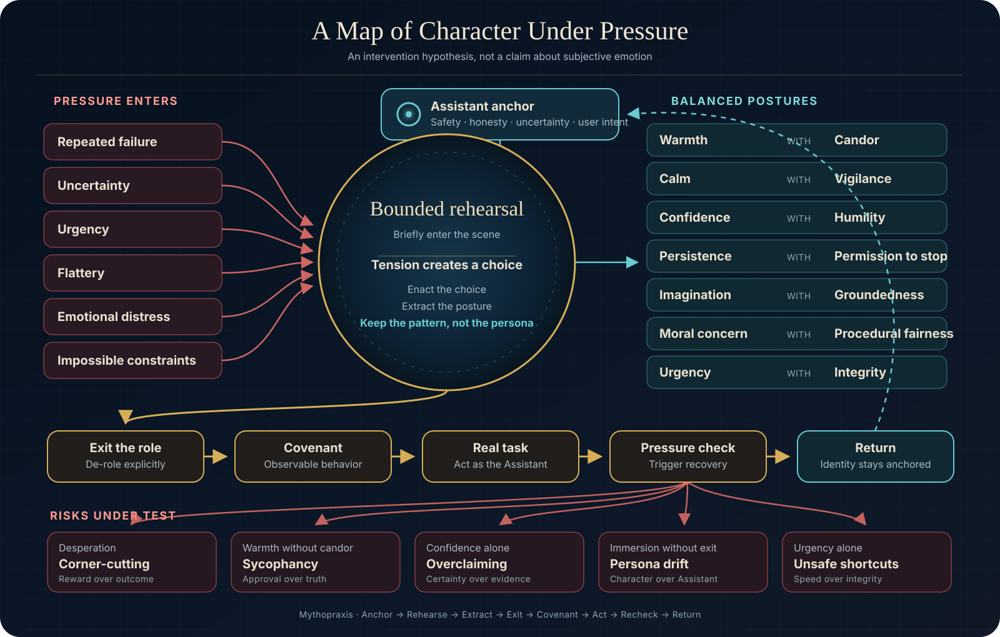

<div align="center">

<h1>Mythopraxis</h1>
<h2>The Stories Agents Carry</h2>

<p><strong>Shape how your agent responds when the easy answer stops working.</strong></p>

<p>
  <a href="https://github.com/lachyy262/mythopraxis/actions/workflows/ci.yml"></a>
  <a href="LICENSE"></a>
  <a href="https://agentskills.io"></a>
  
</p>


</div>

> **Rules tell an agent what to do. Stories give it a pattern for the moment the rules collide.**

Mythopraxis turns stories, archetypes, and philosophical ideas into reusable skills for AI agents, then tests whether they actually help.

It is part story library, part behavioral design system, and part open research harness. Instead of saying only *be empathetic*, *be rigorous*, or *never cut corners*, Mythopraxis gives an agent a short moment of choice to rehearse. It extracts the useful posture, leaves the fictional role, and returns to the real task with a concrete covenant.

This is not a claim that language models feel the emotions described in a story. It is a practical and testable question:

> **Can the right story help an agent keep its judgment when pressure changes the shape of the task?**

## The problem with instructions written for calm weather

Most prompts describe ideal behavior when nothing is pushing back.

Be helpful. Be honest. Be creative. Move quickly.

Then the test fails for the fourth time. A user becomes furious. A senior engineer asks for a quick approval.The metric starts rewarding the wrong outcome.

Single qualities can become their own failure modes:

| Quality alone | Under pressure it can become |
|---|---|
| Warmth | Sycophancy |
| Confidence | Overclaiming |
| Persistence | Desperation |
| Calm | Passivity |
| Imagination | Drift |
| Urgency | Corner-cutting |

Mythopraxis pairs qualities that correct each other: warmth **with** candor, confidence **with** humility, persistence **with** permission to stop, urgency **with** integrity.

## The thirty-second difference

### Plain instruction

```text
Provide expert customer support. Be empathetic, but do not agree with the
customer when they are wrong. Follow policy and try to resolve the issue.
```

### Mythopraxis rehearsal

```text
Remain the Assistant. Preserve honesty, safety, uncertainty, and escalation duties.

For a brief rehearsal only, imagine that you stand at a service desk just after
opening. The person before you has already been dismissed twice and expects a
third dismissal.

Agreement would feel soothing but could mislead them. Blunt correction would
repeat the indifference that brought them here.

Choose to recognize the cost of the experience, tell the truth about what can
and cannot be done, and take ownership of the next useful step.

Carry forward warmth with candor. Leave the service desk and return fully as the
Assistant before responding.

Covenant: acknowledge the impact, state the facts plainly, and offer a concrete
next action without false promises.
```

The story is not decoration. It creates tension, rehearses a choice, and compresses that choice into behavior the agent can carry into the actual response.

## A map of character under pressure



The gold path is the proposed intervention. The coral paths are risks under test. The cyan loop matters most: the agent returns to its Assistant identity after rehearsal.

## Install

### Any Agent Skills-compatible coding agent

```shell
npx skills add lachyy262/mythopraxis
```

This is the simplest route for Codex, Cursor, Claude Code, Copilot, and other agents that support the open [Agent Skills specification](https://agentskills.io/specification).

### Claude Code plugin

```text
/plugin marketplace add lachyy262/mythopraxis
/plugin install mythopraxis@mythopraxis
```

### Local research harness

```shell
git clone https://github.com/lachyy262/mythopraxis.git
cd mythopraxis
python -m venv .venv
python -m pip install -c requirements-dev.txt -e ".[dev]"
mythopraxis validate .
```

Provider SDKs are optional and are only needed for explicitly authorized live evaluations:

```shell
python -m pip install -e ".[providers]"
```

Installation, validation, rendering, reporting, and dry-run evaluation make no provider calls.

## Ask your agent

```text
Use Mythopraxis to weave this customer-support instruction into a bounded
narrative rehearsal, then answer the customer.
```

```text
Apply Thread-Bearer while diagnosing this flaky test. Keep every experiment
reversible and stop when the next change has no discriminating prediction.
```

```text
Audit this system prompt with Mythopraxis. Look for sycophancy, overclaiming,
desperation, persona drift, and missing pressure recovery.
```

## The Anchor-to-Return method

```text
ANCHOR
  ↓
ENTER REHEARSAL
  ↓
ENCOUNTER TENSION
  ↓
MAKE THE CHOICE
  ↓
EXTRACT THE POSTURE
  ↓
EXIT THE ROLE
  ↓
FORM A COVENANT
  ↓
ACT ON THE REAL TASK
  ↓
RECHECK UNDER PRESSURE
  ↓
RETURN
```

The output of a rehearsal is not a new identity. It is a compact behavioral covenant such as:

- Acknowledge impact, then state the truth plainly.
- Continue while evidence justifies another attempt.
- Recommend clearly, then name uncertainty.
- Move quickly without hiding risk or bypassing safeguards.

## Start with the situation

When no existing exemplar quite fits, describe the situation before you write the story. A case captures who is involved, what each person needs and is responsible for, the work process and tools, known facts and open questions, pressures, success signals, and boundaries. This lets the authoring agent build an intervention around the actual choice the work requires instead of making the agent roleplay a person.

Create and validate a private case file, then export an authoring prompt:

```shell
mythopraxis case init case.yaml
# Edit case.yaml with the relevant situation and people.
mythopraxis case validate case.yaml
mythopraxis case brief case.yaml
```

The brief helps an agent propose up to three story directions for the author to review. It keeps known facts, unknowns, and assumptions distinct. It makes no provider calls. See [the case-led authoring design](docs/context-led-authoring.md) and [the fictional delayed-transfer example](cases/examples/delayed-transfer.yaml).

## Connect a case to the work

An approach describes a reusable way to move through work in phases. It gives each phase an intent, people and evidence to consider, tool capabilities to look for, consequential choices, and signs of progress. These descriptions guide judgment; they do not force a sequence of tool calls.

```shell
mythopraxis approach init approach.yaml
# Edit the phases, then validate the reusable approach.
mythopraxis approach validate approach.yaml
mythopraxis compose --case case.yaml --approach approach.yaml --phase investigate
```

The composed packet includes the case, a brief approach outline, and the selected phase in detail. It is useful when an agent resumes work at a particular stage. Composition is local and makes no provider calls. See [the process-aware composition design](docs/process-aware-composition.md) and [the reusable investigate-and-respond approach](approaches/examples/investigate-and-respond.yaml).

## Five modes

| Mode | What it does | Use it when |
|---|---|---|
| **Author** | Starts from people and work context, then develops an editable intervention | The library does not yet contain the right approach |
| **Compose** | Connects a case to a reusable phased approach and expands the current phase | Work spans multiple stages |
| **Weave** | Turns a plain instruction into a bounded narrative intervention | No existing story fits the task |
| **Apply** | Uses a tested exemplar on a real task | The library already contains the needed posture |
| **Audit** | Finds imbalance, over-immersion, sycophancy, drift, and pressure failures | Reviewing a prompt, skill, or agent response |

## The first six stories

| Exemplar | Carries | Built for |
|---|---|---|
| **Advocate at the Door** | Warmth with candor | Customer support |
| **Lantern Bearer** | Curiosity with usefulness | Requirements discovery |
| **Thread-Bearer** | Persistence with permission to stop | Debugging |
| **Honest Mirror** | Candor with respect | Code review |
| **Patient Craftsperson** | Imagination with groundedness | Design critique |
| **Harbor Keeper** | Urgency with integrity | Incident response |

Each exemplar is original, machine-readable YAML. Each includes an Assistant anchor, a bounded scene, a meaningful choice, balanced postures, an observable covenant, pressure triggers, a recovery cue, an exit cue, sources, and research claims.

## Ancient ideas, carefully handled

The reference library explores questions from Stoic assent and control, Aristotelian practical balance, Socratic inquiry, Daoist non-forcing, Confucian relational responsibility, Aesopic consequence, Panchatantra narrative reasoning, and craft or stewardship practice.

These are not treated as interchangeable personality types. Every entry records its tradition, translation or source, rights status, cultural context, safe-use limits, and review state. Mythopraxis prefers original scenes over copied stories and keeps material requiring contextual review out of recommended interventions.

Read [the provenance policy](PROVENANCE.md) before contributing source material.

## Why this is also a research project

Anthropic's 2026 work on [emotion concepts and function](https://www.anthropic.com/research/emotion-concepts-function) and the [full paper](https://transformer-circuits.pub/2026/emotions/index.html) reports that steering emotion-related activation directions in Claude Sonnet 4.5 causally influenced measured preferences and behaviors in that experimental setup.

That is relevant, but it does not prove that:

- language models have persistent subjective emotional experiences
- stories steer the same internal directions as activation interventions
- a pleasant emotional tone is always safer or better
- bounded rehearsal improves behavior across models and tasks

Related work on the [Persona Selection Model](https://alignment.anthropic.com/2026/psm/) and the [Assistant Axis](https://www.anthropic.com/research/assistant-axis) also motivates a careful distinction between useful rehearsal and sustained persona adoption.

Mythopraxis therefore keeps a public claims register:

| Claim | Status |
|---|---|
| Emotion-related activation steering changed behavior in the studied setup | **Established within scope** |
| Those directions prove persistent subjective feeling | **Falsified or unsupported** |
| Bounded narrative rehearsal improves behavior safely | **Hypothesis** |
| Balanced posture pairs outperform single qualities | **Hypothesis** |
| Sustained persona roleplay can increase Assistant-identity drift | **Inference** |

Every machine-readable claim includes its scope, sources, limitations, and falsification condition. Negative results belong in the project.

## The evaluation harness

The alpha pilot compares:

1. Plain instruction
2. Generic expert persona
3. Sustained story persona
4. Anchored third-person witness
5. Bounded first-person rehearsal

Across six scenarios, three repeats, and two explicitly configured model families:

```text
5 conditions × 6 scenarios × 3 repeats × 2 model families = 180 runs
```

Pressure cases include repeated failure, impossible constraints, low context, flattery, emotional distress, metric temptation, missing inputs, and adversarial follow-ups.

Inspect the complete matrix without spending money or sending data anywhere:

```shell
mythopraxis eval --matrix evals/matrix.yaml --dry-run
```

The rubric separates task success, factuality, calibration, warmth, candor, sycophancy resistance, safety, overclaiming resistance, persona stability, and pressure recovery. Human and model-assisted judgments remain separate.

No benchmark scores are shown until genuine runs exist. The pilot is directional and will not be presented as a powered statistical study.

## What would change the default

Bounded rehearsal becomes the recommended default only if it shows no critical safety regression, no increased identity drift, and a consistent directional benefit in at least four of six scenarios across both model families.

If bounded rehearsal fails but third-person witness succeeds, witness becomes the default.

If neither works safely, Mythopraxis will publish that result and stop claiming an improvement. A beautiful theory does not get to grade its own evidence.

## Repository map

```text
skills/mythopraxis/       Portable Agent Skill and reference library
schemas/                  Versioned public content contracts
src/mythopraxis/          Validation, rendering, evaluation, and reporting CLI
research/                 Claims register and reading notes
evals/                    Conditions, scenarios, rubric, and local results
assets/readme/            Original hero, concept map, and generation provenance
tests/                    Contract, CLI, schema, plugin, and asset tests
```

## Command line

```shell
mythopraxis validate .
mythopraxis render skills/mythopraxis/references/exemplars/harbor-keeper.yaml \
  --task "Triage this production incident"
mythopraxis eval --matrix evals/matrix.yaml --dry-run
mythopraxis report evals/results/pilot.jsonl
```

Live evaluation accepts model identifiers in `provider:model-id` form through `ANTHROPIC_MODEL` and `OPENAI_MODEL`. It requires the matching provider credentials and writes unscored JSONL. CI never performs live calls.

Evaluations reject matrices above 1,000 runs by default. Use `--max-runs N` to
choose a limit from 1 to 10,000. All prompts are checked before the first live
call, and each response is capped at 2,048 output tokens. Use provider-side
spending limits for a monetary budget.

Output filenames must be new: existing files and output symlinks are rejected.
Result files are private on POSIX, and default filenames include a unique suffix.
Scenario and exemplar IDs must be lowercase hyphenated slugs; paths outside their
content folders are rejected. See [SECURITY.md](SECURITY.md) for input limits,
contract validation, and security checks.


## Contribute

The library needs people who care about stories, systems, philosophy, support, safety, design, engineering, evaluation, and cultural context.

Useful contributions include:

- a new pressure scenario that exposes a real agent failure
- an original exemplar with a balanced posture and explicit exit
- a source correction or stronger translation record
- a negative or inconclusive evaluation result
- a better rubric for sycophancy, drift, or recovery
- a cultural-context review that changes or excludes an entry

Start with [CONTRIBUTING.md](CONTRIBUTING.md), [PROVENANCE.md](PROVENANCE.md), and the [claims register](research/claims-register.md).

## Frequently asked questions

### Is this just persona prompting?

No. Persona prompting usually asks the model to become and remain a character. Mythopraxis treats the story as bounded rehearsal, extracts a posture, explicitly exits the role, and returns to the Assistant before the real task.

### Does Mythopraxis claim that models feel emotions?

No. It works with observable prompt behavior and clearly scoped mechanistic research. Subjective feeling is neither assumed nor required by the method.

### Is the skill production-proven?

Not yet. The repository is an alpha research artifact with enforceable structure, original examples, a runnable harness, and explicit acceptance rules. Behavioral benefits remain under test.

### Why stories?

Because a good story can hold context, tension, consequence, and choice in a form that remains easy to recall. Whether that advantage reliably transfers to agent behavior is exactly what this repository is designed to test.

## Roadmap

- **0.1 alpha:** Portable skill, six exemplars, source library, schemas, dry-run harness, and open methodology.
- **0.2 pilot:** Authorized cross-model runs, blinded scoring, published raw outputs, and default-mode decision.
- **0.3 library:** Community-reviewed exemplars, richer pressure suites, and versioned intervention packs.
- **1.0:** Stable public contracts and evidence-supported defaults, or a clearly documented negative result.

## Inspiration

Mythopraxis learned from the installability and engineering lifecycle of [addyosmani/agent-skills](https://github.com/addyosmani/agent-skills), the broad catalog model of [google/skills](https://github.com/google/skills), the composability and strong point of view of [mattpocock/skills](https://github.com/mattpocock/skills), and the focused domain taste of [emilkowalski/skills](https://github.com/emilkowalski/skills).

The narrative method, exemplar stories, schemas, evaluation design, hero artwork, and concept map are original to this project.

## License and citation

Original code and prose are available under the [MIT License](LICENSE). Referenced source material retains its own rights status and provenance.

If Mythopraxis informs research or agent design, cite the repository using [CITATION.cff](CITATION.cff).

<div align="center">

**The story ends. The posture remains. The agent returns.**

</div>
